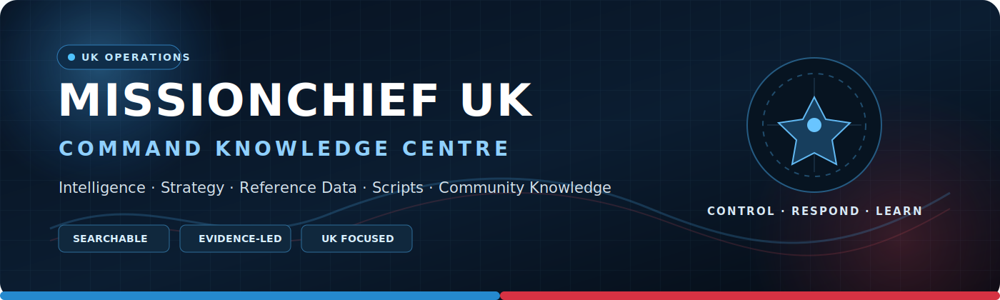

<div align="center">



<br>

[](https://conroy1988.github.io/MissionChief-UK/)
[](docs/releases/v1.1.0.md)
[](#-production-command-posture)
[](https://conroy1988.github.io/MissionChief-UK/api/)

[](https://github.com/Conroy1988/MissionChief-UK/actions/workflows/validate.yml)
[](https://github.com/Conroy1988/MissionChief-UK/actions/workflows/deploy-pages.yml)
[](https://github.com/Conroy1988/MissionChief-UK/issues)
[](LICENSE)

### **Mission control for the United Kingdom game. Not another loose collection of tips.**

**1,062 official UK missions · 154 canonical mission records · 96 fully canonical missions · Instant command search · Fleet planning · Evidence governance · Versioned public data**

[**Command Centre**](https://conroy1988.github.io/MissionChief-UK/) · [**Complete Mission Lookup**](https://conroy1988.github.io/MissionChief-UK/tools/mission-lookup/) · [**Verification Status**](https://conroy1988.github.io/MissionChief-UK/reference/mission-verification-status/) · [**Fleet Planner**](https://conroy1988.github.io/MissionChief-UK/tools/fleet-planner/) · [**Resource Comparison**](https://conroy1988.github.io/MissionChief-UK/tools/resource-comparison/) · [**Static API**](https://conroy1988.github.io/MissionChief-UK/api/) · [**v1.1.0 Notes**](docs/releases/v1.1.0.md)

</div>

---

# 🚨 Mission Briefing

**MissionChief UK** is an independent operations-intelligence platform for the United Kingdom version of MissionChief.

It combines the complete official UK mission catalogue with conservative canonical records, browser-side command tools, strict validation and read-only public data. Unknown internal game fields remain visible rather than being guessed.

| Command question | Platform answer |
|---|---|
| What missions exist? | Search all **1,062 official UK mission records**. |
| What does a mission require? | Read the official fields and use canonical mappings only where their semantics are verified. |
| What unlocks an incident? | Inspect prerequisites, buildings, extensions, personnel and specialist capabilities. |
| What is fully verified? | Use the five-gate verification programme and evidence ledgers. |
| What remains uncertain? | Official-only, mapped and fully canonical states remain visibly distinct. |
| Can another tool consume the data? | Use the versioned Static API and separate official endpoints. |

> **Command principle:** information is operational only when it is easy to find, precise enough to act on and explicit about what is not yet known.

---

# 📡 Production Command Posture

The numbered core programme is complete through **Stage 34**. Version **1.1.0** adds complete official catalogue coverage and an enforced route toward 100% fully canonical mission intelligence.

| Intelligence domain | Current baseline | Operational result |
|---|---:|---|
| **Official UK missions** | **1,062** | Complete searchable catalogue with published fields retained |
| **Canonical missions** | **154** | Normalized higher-trust records |
| **Official/canonical ID matches** | **137** | Direct exact-ID evidence links |
| **Fully canonical missions** | **96** | Passed identity, mapping, operational and final evidence gates |
| **Official records awaiting canonical records** | **925** | Published records whose remaining semantics stay unguessed |
| **Canonical-only overlays** | **17** | Derived records without standalone official IDs |
| **Deployable resources** | **46** | Vehicles, boats, trailers and specialist equipment |
| **Infrastructure** | **18** | Buildings and extensions |
| **Qualifications** | **11** | Operational roles and verified course fields |
| **Canonical searchable entities** | **229** | Missions, resources, infrastructure and qualifications |
| **Public interface** | **Static API v1.1.0** | Versioned canonical and official data surfaces |

> [!IMPORTANT]
> **Official does not automatically mean canonically mapped.** Catalogue presence proves publication. Canonical interpretation is applied only after the relevant internal keys and operational semantics are verified.

---

# 💯 Mission Verification Programme

Every official mission progresses through five enforced gates:

1. **Captured** — retained losslessly from the official UK feed.
2. **Identity verified** — exact official ID and UK name match a canonical record.
3. **Requirements mapped** — every requirement, chance and prerequisite key is verified or narrowly classified as non-operational.
4. **Operationally verified** — probabilities, patients, personnel, relationships, variants and conditional mechanics have reproducible evidence.
5. **Fully canonical** — final evidence-completeness audit passed.

| Verification gate | Current position |
|---|---:|
| Captured | **1,062 / 1,062 — 100%** |
| Identity verified | **137 / 1,062 — 12.90%** |
| Fully canonical | **96 / 1,062 — 9.04%** |
| Remaining to fully canonical | **966** |

Batch 1 established **11 fully canonical missions**. The current evidence-controlled batches are:

```text
Batch 1: 0, 1, 2, 3, 4, 6, 7, 8, 9, 10,
         11
Batch 2: 13, 14, 15, 16, 17, 18, 19, 23, 24, 27
Batch 3: 32, 58, 65, 202, 203, 313, 334, 352, 365, 366,
         388, 399, 400, 421, 435, 468, 472, 475, 535, 541,
         570, 577, 624, 638, 668, 772, 857, 858
Batch 4: 21, 22, 31, 301, 353
Batch 5: 232, 236, 317, 401, 481, 482, 513, 517, 575, 597,
         669, 849, 850, 851, 852
Batch 6: 59, 139, 314, 404, 815, 824
Batch 7: 107, 153, 175, 178, 248, 249, 250, 402, 406
Batch 8: 169, 177, 243, 244, 256, 518
Batch 9: 180, 251, 469
Batch 10: 134, 579
Batch 11: 30
```

Batches 4–11 extend the verified vehicle-key contract through evidence-safe, exact-ID promotions. All 96 records pass aggregate identity and strict-equivalence validation.

[Review the live verification backlog →](https://conroy1988.github.io/MissionChief-UK/reference/mission-verification-status/)

---

# 🔎 Complete UK Mission Lookup

Mission Lookup combines two evidence tiers in one interface:

| Evidence tier | What it contains | How it is shown |
|---|---|---|
| **Canonical mapped** | 154 normalized project records | Verified resources, alternatives, probabilities, patients, personnel and preconditions where supported |
| **Official UK catalogue** | 1,062 public records | Published fields reproduced with canonical status explicit |

Search covers mission IDs, names, POIs, service families, requirements, probabilities, prerequisites, patients, personnel, availability, follow-ups, expansions, overlays and additional fields.

[Launch Mission Lookup →](https://conroy1988.github.io/MissionChief-UK/tools/mission-lookup/)

---

# ⌨️ Command Surface

| Command route | Purpose |
|---|---|
| **Global Command Search** | Press `Ctrl+K`, `⌘K` or `/` to search canonical collections |
| **Mission Lookup** | Search complete official and canonical mission intelligence |
| **Verification Status** | Inspect every mission’s gate, blockers and next action |
| **Resource Comparison** | Compare resources and qualifications without hiding unknowns |
| **Concurrent Fleet Planner** | Multiply guaranteed requirements across simultaneous incidents |
| **Query Catalogue** | Match ordinary language against the canonical evidence index |
| **Official Mission Catalogue** | Review provenance, refresh controls and accuracy boundaries |
| **Static Data API** | Consume canonical, official and verification JSON |

All tools are browser-side and read-only. They do not authenticate against, access or modify a MissionChief account.

---

# 🗂️ Data Estate

```text
data/uk/
├── missions/                       154 canonical mission records
├── mission-verification-registry.json
├── mission-verification-batches/   evidence-controlled promotions
├── official-key-mappings.json
├── vehicles/                       46 deployable resources
├── infrastructure/                 18 buildings and extensions
└── training/                       11 qualification records
```

Canonical public exports:

```text
docs/assets/data/v1/
├── manifest.json
├── missions.json
├── vehicles.json
├── infrastructure.json
├── training.json
├── search-index.json
├── faq.json
└── openapi.json
```

Official and verification exports:

```text
docs/assets/data/official/
├── uk-missions.json
├── uk-mission-coverage.json
└── uk-mission-verification.json
```

---

# 🧠 Evidence Contract

| Marker | Classification | Operational meaning |
|:---:|---|---|
| ✅ | **Verified** | Reproduced in the UK game or supported by a suitable primary source |
| 🧮 | **Calculated** | Derived transparently from verified values |
| 🎯 | **Recommended** | Strategic guidance that may vary by account or geography |
| ⚠️ | **Review required** | Incomplete, contradictory or awaiting reproduction |
| 📡 | **Official catalogue** | Published by the UK feed but not automatically normalized |

Omitted values remain unknown, not zero. Internal official keys remain visible until their UK meaning can be mapped safely.

---

# 🔄 Catalogue and Validation Pipeline

```text
Official UK feed
      ↓
JSON, identity and checksum validation
      ↓
Official/canonical coverage reconciliation
      ↓
Verification batch merge
      ↓
Aggregate identity and strict key-equivalence audits
      ↓
Evidence-safe candidate and key-backlog reports
      ↓
Verification status and deterministic exports
      ↓
Strict MkDocs, link and built-site audits
      ↓
JavaScript and browser acceptance
      ↓
Pages deployment and versioned release
```

Local verification:

```bash
pip install -r requirements.txt
python scripts/validate_data.py
python scripts/reconcile_official_mission_coverage.py
python scripts/validate_official_mission_catalogue.py
python scripts/merge_verification_registry_batches.py
python scripts/report_promoted_mapping_failures.py
python scripts/validate_official_key_mappings.py
python scripts/report_canonical_candidates.py --limit 50
python scripts/report_key_mapping_backlog.py --limit 50 --examples 5
python scripts/generate_mission_verification_status.py
python scripts/validate_verification_programme_assets.py
python scripts/generate_exports.py
python scripts/generate_faq.py
python scripts/release_readiness.py
python scripts/audit_links.py
mkdocs build --strict --site-dir site
python scripts/release_readiness.py --site-dir site
npm install --no-audit --no-fund
npx playwright install --with-deps
npm run test:e2e
```

---

# 🧭 Entry Points

| You are… | Begin here |
|---|---|
| **A new UK player** | [Start Here](https://conroy1988.github.io/MissionChief-UK/getting-started/) |
| **Searching for any UK mission** | [Complete Mission Lookup](https://conroy1988.github.io/MissionChief-UK/tools/mission-lookup/) |
| **Checking verification progress** | [Mission Verification Status](https://conroy1988.github.io/MissionChief-UK/reference/mission-verification-status/) |
| **Planning several incidents** | [Concurrent Fleet Planner](https://conroy1988.github.io/MissionChief-UK/tools/fleet-planner/) |
| **Comparing specialist capability** | [Resource Comparison](https://conroy1988.github.io/MissionChief-UK/tools/resource-comparison/) |
| **Building an integration** | [Static API](https://conroy1988.github.io/MissionChief-UK/api/) |
| **Submitting evidence** | [Contribution Standard](docs/contributing/index.md) |

---

# 🤝 Contribute

Useful contributions include reproducible mission requirements, screenshots or primary-source links, internal-key mappings, vehicle economics, staffing evidence, qualification details, accessibility findings and failures in generated tools or endpoints.

Every accepted change should leave the platform more precise—not merely larger.

[Open an issue](https://github.com/Conroy1988/MissionChief-UK/issues/new/choose) · [Read the research checklist](docs/contributing/research-checklist.md) · [Review the roadmap](docs/ROADMAP.md)

---

# ⚖️ Independence

MissionChief UK is an independent community project created and maintained by [Conroy1988](https://github.com/Conroy1988). It is **not operated by, endorsed by or affiliated with SHPlay GmbH or the official MissionChief team**.

MissionChief names, trademarks, screenshots, game artwork and third-party materials remain the property of their respective owners. Original project code and content are released under the [MIT Licence](LICENSE), unless a file states otherwise.

<div align="center">

## 🚨 **Build the knowledge. Verify the intelligence. Command the game.**

[](https://conroy1988.github.io/MissionChief-UK/)

</div>
