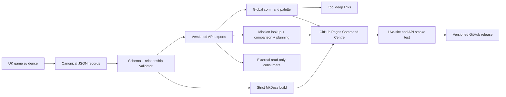

<div align="center">


<br>

[](https://conroy1988.github.io/MissionChief-UK/)
[](https://github.com/Conroy1988/MissionChief-UK/releases/latest)
[](#-production-command-posture)
[](https://conroy1988.github.io/MissionChief-UK/api/)

[](https://github.com/Conroy1988/MissionChief-UK/actions/workflows/validate.yml)
[](https://github.com/Conroy1988/MissionChief-UK/actions/workflows/deploy-pages.yml)
[](https://github.com/Conroy1988/MissionChief-UK/issues)
[](LICENSE)

### **Mission control for the United Kingdom game. Not another loose collection of tips.**

**Verified operational data · Instant command search · Service doctrine · Interactive planning · Evidence governance · Versioned public exports**

[**Open Command Centre**](https://conroy1988.github.io/MissionChief-UK/) · [**Mission Lookup**](https://conroy1988.github.io/MissionChief-UK/tools/mission-lookup/) · [**Fleet Planner**](https://conroy1988.github.io/MissionChief-UK/tools/fleet-planner/) · [**Resource Comparison**](https://conroy1988.github.io/MissionChief-UK/tools/resource-comparison/) · [**Static API**](https://conroy1988.github.io/MissionChief-UK/api/) · [**Quality Assurance**](docs/quality-assurance.md) · [**Release Notes**](docs/releases/v1.0.1.md)

</div>

---

# 🚨 Mission Briefing

**MissionChief UK** is an independent operations-intelligence platform for the United Kingdom version of MissionChief.

It combines human-readable guidance, canonical structured records, browser-side command tools, strict evidence rules and a versioned static API. The result is a single place to answer the questions that matter during real play:

- What does this mission actually require?
- Which resource, qualification, building or extension unlocks the response?
- What fleet is needed for several incidents at once?
- Which value is verified, calculated, recommended or still unknown?
- Can another tool consume the same validated data without scraping the site?

> **Command principle:** information is operational only when it is easy to find, precise enough to act on, and explicit about what is not yet known.

<table>
<tr>
<td width="25%" align="center"><strong>🔎 SEARCH</strong><br><sub>Find missions, resources, aliases, POIs and preconditions.</sub></td>
<td width="25%" align="center"><strong>🧠 UNDERSTAND</strong><br><sub>Separate guaranteed, probabilistic, conditional and alternative requirements.</sub></td>
<td width="25%" align="center"><strong>📐 PLAN</strong><br><sub>Compare resources and model concurrent incident demand.</sub></td>
<td width="25%" align="center"><strong>✅ VERIFY</strong><br><sub>Trace populated facts to controlled evidence and validation.</sub></td>
</tr>
</table>

---

# 📡 Production Command Posture

The numbered core delivery programme is complete through **Stage 34**, with continuous evidence maintenance operating on the **v1.0.1** production baseline.

| Intelligence domain | Current baseline | Operational result |
|---|---:|---|
| **Verified missions** | **62** | Cross-service generation conditions, requirements, patients, prisoners, towing and rewards |
| **Canonical resources** | **46** | Vehicles, trailers, boats, specialist equipment, capabilities and deployment metadata |
| **Infrastructure** | **18** | Buildings and extensions enforced through schema-controlled references |
| **Qualifications** | **11** | Operational roles with unverified course details deliberately omitted |
| **Searchable entities** | **137** | One global command index spanning every canonical collection |
| **Service groups** | **11** | Fire, Ambulance, Police, maritime, mountain, SAR, EOD, airfield, recovery and railway operations |
| **Mission batches** | **13** | Controlled publication units spanning the current verified catalogue |
| **Public interface** | **API v1.0.1** | Manifest, collections, search index, generated FAQ and OpenAPI contract |
| **Quality assurance** | **Cross-browser** | Built-site Chromium plus deployed Chromium, Firefox, iPhone WebKit and iPad WebKit acceptance |

> [!IMPORTANT]
> **Verified applies only to populated fields.** Missing data remains unknown. It is never silently converted into zero, false or “not required”.

## Core programme progression

```text
STAGES 01–12  Architecture, schemas, verification, contribution and delivery
STAGES 13–20  Core emergency-service production data
STAGE 21      Railway Police and Railway Fire Response
STAGES 22–27  Infrastructure, qualifications, economics and specialist enrichment
STAGES 28–34  Public exports, intelligence tools, generated FAQ and Static Data API v1
CONTINUOUS    Evidence maintenance, command search and verified-data expansion
```

---

# ⌨️ Instant Command Search

The deployed Command Centre now includes a **site-wide verified-data command palette**.

Press **`Ctrl+K`**, **`⌘K`** or **`/`** from any page to:

- search all 137 canonical missions, resources, infrastructure records and qualifications;
- filter instantly by intelligence collection;
- navigate entirely from the keyboard;
- deep-link a selected mission into Mission Lookup;
- deep-link other canonical records into the Query Catalogue;
- retain a read-only trust boundary with no MissionChief authentication or account access; and
- use the same generated `search-index.json` consumed by the public API.

The palette is responsive across desktop, tablet, iPhone and iPad layouts and is included in Playwright acceptance coverage.

[Launch the Command Centre →](https://conroy1988.github.io/MissionChief-UK/)

---

# 🛰️ Command Surface

| Command route | What it does | Open |
|---|---|---|
| **Global Command Search** | Searches every canonical collection from any page through `Ctrl+K`, `⌘K` or `/` | [Open Command Centre →](https://conroy1988.github.io/MissionChief-UK/) |
| **Mission Lookup** | Searches mission IDs, names, aliases, POIs, mission types and service groups | [Launch →](https://conroy1988.github.io/MissionChief-UK/tools/mission-lookup/) |
| **Resource Comparison** | Compares canonical vehicles and qualifications without hiding unknown fields | [Launch →](https://conroy1988.github.io/MissionChief-UK/tools/resource-comparison/) |
| **Concurrent Fleet Planner** | Multiplies guaranteed requirements across simultaneous incidents while preserving alternative groups | [Launch →](https://conroy1988.github.io/MissionChief-UK/tools/fleet-planner/) |
| **Query Catalogue** | Matches ordinary words and short questions against the generated evidence index | [Launch →](https://conroy1988.github.io/MissionChief-UK/tools/query-catalogue/) |
| **Verified Mission Records** | Exposes the published cross-service mission catalogue | [Browse →](https://conroy1988.github.io/MissionChief-UK/reference/verified-mission-records/) |
| **Verified Vehicle Records** | Exposes canonical deployable-resource records | [Browse →](https://conroy1988.github.io/MissionChief-UK/reference/verified-vehicle-records/) |
| **Static Data API** | Publishes versioned, read-only JSON collections and an OpenAPI description | [Read contract →](https://conroy1988.github.io/MissionChief-UK/api/) |
| **Quality Assurance** | Documents desktop, mobile, accessibility and deployed-site acceptance coverage | [Review gates →](docs/quality-assurance.md) |

All interactive tools are browser-side and read-only. They consume the same validated exports used by the documentation and do **not** access, modify or authenticate against a MissionChief account.

---

# 🚒 Operational Coverage

The platform currently represents the following response theatres:

<table>
<tr>
<td width="33%" valign="top">

### Core response

- Fire and Rescue
- Ambulance and HART
- Police and Public Order
- Cross-service incidents

</td>
<td width="33%" valign="top">

### Maritime and remote

- Coastguard
- Lifeboat and Ocean Rescue
- Mountain Rescue
- Search and Rescue HQ

</td>
<td width="33%" valign="top">

### Specialist operations

- Bomb Disposal and EOD
- Airfield Operations
- Recovery and HGV Recovery
- Railway Police and Railway Fire Response

</td>
</tr>
</table>

Each service page links operational guidance to the canonical data programme rather than maintaining an isolated set of claims.

---

# 🗂️ Canonical Data Estate

```text
data/uk/
├── missions/         62 production mission records
├── vehicles/         46 canonical deployable resources
├── infrastructure/   18 buildings and extensions
└── training/         11 qualification records
```

The validator enforces:

- Draft 2020-12 JSON Schema conformance;
- unique identifiers and valid verification dates;
- mission-to-resource referential integrity;
- infrastructure-precondition integrity;
- guaranteed, probabilistic, conditional and alternative requirements;
- patient, prisoner, towing and personnel-range semantics;
- controlled qualification records; and
- release metadata and static-site readiness.

## Generated public interface

Every validated build produces:

```text
docs/assets/data/v1/
├── manifest.json
├── missions.json
├── vehicles.json
├── infrastructure.json
├── training.json
├── search-index.json
├── faq.json
└── openapi.json
```

Example production endpoints:

```text
https://conroy1988.github.io/MissionChief-UK/assets/data/v1/manifest.json
https://conroy1988.github.io/MissionChief-UK/assets/data/v1/missions.json
https://conroy1988.github.io/MissionChief-UK/assets/data/v1/search-index.json
https://conroy1988.github.io/MissionChief-UK/assets/data/v1/openapi.json
```

[Data export contract](docs/reference/data-exports.md) · [API guide](docs/api/index.md) · [Data-entry standard](docs/reference/data-entry-guide.md)

---

# 🧠 Evidence Contract

| Marker | Classification | Operational meaning |
|:---:|---|---|
| ✅ | **Verified** | Reproduced in the current UK game or supported by a suitable primary source |
| 🧮 | **Calculated** | Derived transparently from verified values with the method retained |
| 🎯 | **Recommended** | Strategic guidance that may vary by account, geography or play style |
| ⚠️ | **Review required** | Incomplete, contradictory, outdated or awaiting reproduction |

The evidence model is intentionally conservative:

- unsupported values are omitted;
- temporary event multipliers do not replace canonical rewards;
- directory-level evidence is not presented as a complete dispatch table;
- source URLs and verification dates remain part of the record; and
- contributions must be reproducible by another player.

[Read the complete data and evidence standard →](docs/reference/data-standard.md)

---

# ⚙️ Intelligence Architecture



## Delivery gate

```text
JSON syntax and schemas
        ↓
Relationship and range validation
        ↓
Versioned exports and generated FAQ
        ↓
Repository and API readiness audit
        ↓
Documentation link and heading-anchor audit
        ↓
MkDocs strict build and built-site audit
        ↓
All JavaScript syntax validation
        ↓
Chromium acceptance against the built site
        ↓
Global command-palette and deep-link acceptance
        ↓
GitHub Pages deployment
        ↓
Live HTTP and public API smoke test
        ↓
Chromium, Firefox, iPhone WebKit and iPad WebKit acceptance
        ↓
Versioned release
```

Local verification:

```bash
pip install -r requirements.txt
python scripts/validate_data.py
python scripts/generate_exports.py
python scripts/generate_faq.py
python scripts/release_readiness.py
python scripts/audit_links.py
mkdocs build --strict --site-dir site
python scripts/release_readiness.py --site-dir site
npm install
npx playwright install --with-deps
for file in docs/javascripts/*.js; do node --check "$file"; done
npm run test:e2e
```

[Read the quality-assurance guide →](docs/quality-assurance.md)

---

# 🧭 Choose Your Entry Point

| You are… | Begin here |
|---|---|
| **A new UK player** | [Start Here](https://conroy1988.github.io/MissionChief-UK/getting-started/) and [First Expansion](https://conroy1988.github.io/MissionChief-UK/getting-started/first-expansion/) |
| **An established commander** | [Emergency Services](https://conroy1988.github.io/MissionChief-UK/services/) and [Mission Lookup](https://conroy1988.github.io/MissionChief-UK/tools/mission-lookup/) |
| **Searching during live play** | Open the [Command Centre](https://conroy1988.github.io/MissionChief-UK/) and press `Ctrl+K`, `⌘K` or `/` |
| **Planning account growth** | [Account Progression](https://conroy1988.github.io/MissionChief-UK/strategy/account-progression/) and [Station Placement](https://conroy1988.github.io/MissionChief-UK/strategy/station-placement/) |
| **Running alliance operations** | [Alliance Operations](https://conroy1988.github.io/MissionChief-UK/alliances/) |
| **Using scripts and extensions** | [Compatibility Centre](https://conroy1988.github.io/MissionChief-UK/scripts/compatibility-centre/) |
| **Building a tool or integration** | [Static API](https://conroy1988.github.io/MissionChief-UK/api/) and [Generated Exports](https://conroy1988.github.io/MissionChief-UK/reference/data-exports/) |
| **Submitting evidence** | [Contribution Standard](docs/contributing/index.md) and [Verification Workflow](docs/contributing/verification-workflow.md) |

# 🤝 Contribute to the Intelligence Picture

Useful contributions include:

- reproducible mission requirements;
- screenshots or primary-source links supporting a field;
- corrections to aliases, service ownership or generation conditions;
- vehicle economics and staffing evidence;
- qualification and course evidence;
- accessibility and mobile-workflow findings; and
- failures in the generated tools, global command search or public API.

Every accepted change should leave the platform more precise, not merely larger.

[Open an issue](https://github.com/Conroy1988/MissionChief-UK/issues/new/choose) · [Read the research checklist](docs/contributing/research-checklist.md) · [Review the roadmap](docs/ROADMAP.md)

---

# ⚖️ Independence and Attribution

MissionChief UK is an independent community project created and maintained by [Conroy1988](https://github.com/Conroy1988). It is **not operated by, endorsed by or affiliated with SHPlay GmbH or the official MissionChief team**.

MissionChief names, trademarks, screenshots, game artwork and third-party materials remain the property of their respective owners. Original project code and content are released under the [MIT Licence](LICENSE), unless a file states otherwise.

<div align="center">

## 🚨 **Build the knowledge. Verify the intelligence. Command the game.**

[](https://conroy1988.github.io/MissionChief-UK/)

</div>