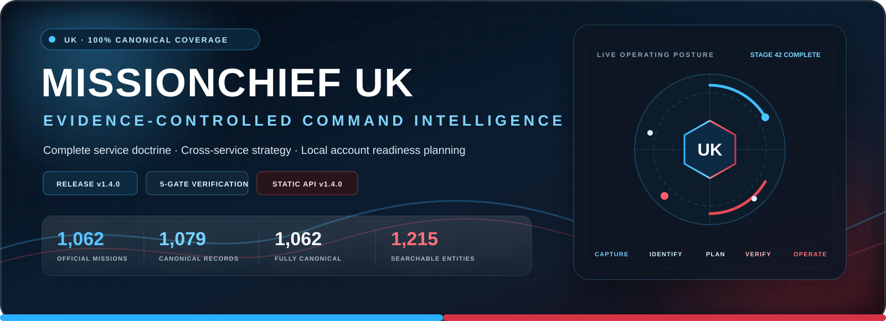

<div align="center">



<br>

[](https://conroy1988.github.io/MissionChief-UK/)
[](docs/releases/v1.4.0.md)
[](#production-command-posture)
[](https://conroy1988.github.io/MissionChief-UK/api/)

[](https://github.com/Conroy1988/MissionChief-UK/actions/workflows/validate.yml)
[](https://github.com/Conroy1988/MissionChief-UK/actions/workflows/deploy-pages.yml)
[](https://github.com/Conroy1988/MissionChief-UK/issues)
[](LICENSE)

### **Evidence-led MissionChief UK command intelligence, operational guidance and planning.**

**1,062 official UK missions · 1,079 canonical mission records · 104 resources · complete service guides · cross-service strategy · local-only readiness planning · versioned public data**

[**Command Centre**](https://conroy1988.github.io/MissionChief-UK/) · [**Mission Lookup**](https://conroy1988.github.io/MissionChief-UK/tools/mission-lookup/) · [**Account Readiness**](https://conroy1988.github.io/MissionChief-UK/tools/account-readiness/) · [**Service Guides**](https://conroy1988.github.io/MissionChief-UK/services/) · [**Strategy**](https://conroy1988.github.io/MissionChief-UK/strategy/) · [**Static API**](https://conroy1988.github.io/MissionChief-UK/api/) · [**v1.4.0 Notes**](docs/releases/v1.4.0.md)

</div>

---

# Mission briefing

**MissionChief UK** is an independent operations-intelligence platform for the United Kingdom version of MissionChief.

It combines the complete retained official UK mission catalogue with conservative canonical data, mature emergency-service guidance, cross-service account planning, alliance doctrine, responsive browser tools and deterministic public exports.

Unknown game fields remain unknown. The platform does not convert missing costs, capacities, staffing rules, course details or unlock values into zero or guesses.

| Command question | Platform answer |
|---|---|
| What UK missions exist? | Search all 1,062 retained official mission records and 1,079 canonical records. |
| What does a mission require? | Inspect guaranteed, alternative, probabilistic, conditional, personnel, patient, prisoner and recovery semantics. |
| How should a service progress? | Use complete evidence-labelled operational guides for every represented service group. |
| When is expansion safe? | Apply cross-service gates, protected reserve and route/destination planning. |
| Can current inventory handle several incidents? | Build a local-only scenario in Account Readiness. |
| What remains uncertain? | Review explicit evidence boundaries and omitted fields. |
| Can another tool consume the data? | Use the compatible versioned Static API v1. |

> **Command principle:** evidence becomes operational only when it is precise, findable, reproducible and explicit about what is not known.

---

# Production command posture

The numbered programme is complete through **Stage 42**. Version **1.4.0** packages the complete evidence estate, operational-guide programme, cross-service strategy, Alliance Operations, Account Readiness and the full UX/accessibility audit.

| Intelligence domain | v1.4.0 baseline | Operational result |
|---|---:|---|
| Official UK missions | 1,062 | Lossless searchable catalogue |
| Canonical missions | 1,079 | Normalised evidence-controlled records and variants |
| Direct official/canonical matches | 1,062 | Complete current official ID mapping |
| Fully canonical official records | 1,062 | Passed all evidence-completeness gates |
| Deployable resources | 104 | Vehicles, vessels, trailers, equipment and specialist resources |
| Infrastructure | 20 | Buildings and extensions |
| Training and role records | 12 | Verified operational roles and course fields |
| Service programmes | 10 | Complete guidance for every represented emergency-service group |
| Strategy programmes | 4 | Progression, placement, alliance and readiness planning |
| Public data contract | API v1 / data 1.4.0 | Compatible deterministic JSON and OpenAPI publication |

The current catalogue is fully mapped. Future upstream changes still require provenance, schema validation and exact evidence reproduction before becoming operational guidance.

---

# Complete operational guide estate

Stage 37A–37I delivers mature guides for:

- [Fire and Rescue](https://conroy1988.github.io/MissionChief-UK/services/fire-and-rescue/);
- [Ambulance and HART](https://conroy1988.github.io/MissionChief-UK/services/ambulance/);
- [Police and Public Safety](https://conroy1988.github.io/MissionChief-UK/services/police/);
- [Coastguard and Lifeboat](https://conroy1988.github.io/MissionChief-UK/services/coastguard-and-lifeboat/);
- [Mountain Rescue](https://conroy1988.github.io/MissionChief-UK/services/mountain-rescue/);
- [Search and Rescue HQ](https://conroy1988.github.io/MissionChief-UK/services/search-and-rescue/);
- [Bomb Disposal and EOD](https://conroy1988.github.io/MissionChief-UK/services/bomb-disposal/);
- [Airfield Operations](https://conroy1988.github.io/MissionChief-UK/services/airfield-operations/);
- [Recovery and HGV Recovery](https://conroy1988.github.io/MissionChief-UK/services/recovery/); and
- [Railway Police and Railway Fire Response](https://conroy1988.github.io/MissionChief-UK/services/railway-response/).

Each programme separates verified mechanics, transparent calculations and recommended strategy. The guides cover infrastructure, resources, personnel, training, mission progression, geography, cross-service dependencies, scalable templates, concurrency, common failures and recovery-to-readiness.

---

# Cross-service command planning

## Account progression

[Cross-Service Account Progression](https://conroy1988.github.io/MissionChief-UK/strategy/account-progression/) defines expansion gates, account stages, service sequencing, dependency matrices and protected-reserve doctrine without inventing universal unlock thresholds.

## Station placement

[Station Placement and Coverage](https://conroy1988.github.io/MissionChief-UK/strategy/station-placement/) uses routes, destinations, access points, response clusters, specialist hubs and relief bases—not visually even map circles.

## Alliance Operations

[Alliance Operations](https://conroy1988.github.io/MissionChief-UK/alliances/) provides member, dispatcher and administrator modes, mutual-support doctrine, shared-infrastructure controls, major-incident command, recruitment and moderation boundaries.

---

# Account Readiness Planner

[Account Readiness](https://conroy1988.github.io/MissionChief-UK/tools/account-readiness/) combines selected canonical missions with local user-entered inventory.

It:

- adds guaranteed requirements across selected concurrency;
- subtracts explicit protected reserve;
- allocates independent alternative groups without silently reusing one unit;
- preserves required-at-incident and available-before-generation personnel separately;
- checks published towing and carrier compatibility in a separate logistics pass;
- reports recovery assets as clearing workloads;
- leaves blank inventory unknown rather than zero; and
- supports explicit browser-local save/load and JSON import/export.

The tool does not sign in to, scrape or mutate MissionChief.

---

# Command surfaces

| Route | Purpose |
|---|---|
| Global command palette | `Ctrl+K`, `⌘K` or `/` searches canonical collections |
| Mission Lookup | Search canonical and official UK mission evidence |
| Account Readiness | Compare several incidents with inventory and reserve |
| Resource Comparison | Compare populated resource and qualification fields |
| Concurrent Fleet Planner | Multiply guaranteed requirements |
| Query Catalogue | Deterministic cross-collection evidence retrieval |
| Official Mission Catalogue | Review provenance and lossless official fields |
| Static API | Consume versioned canonical and official data |

All public tools are read-only.

---

# Data estate

```text
data/uk/
├── missions/                       1,079 canonical mission records
├── mission-verification-registry.json
├── mission-verification-batches/   evidence-controlled promotions
├── official-key-mappings.json
├── vehicles/                       104 deployable resources
├── infrastructure/                 20 buildings and extensions
└── training/                       12 training and role records
```

Canonical public exports:

```text
docs/assets/data/v1/
├── manifest.json
├── missions.json
├── vehicles.json
├── infrastructure.json
├── training.json
├── search-index.json
├── faq.json
└── openapi.json
```

Official and verification exports remain separately published under `docs/assets/data/official/`.

---

# Evidence contract

| Marker | Classification | Operational meaning |
|:---:|---|---|
| ✅ | Verified | Reproduced in the UK game or supported by a suitable primary source |
| 🧮 | Calculated | Derived transparently from verified values |
| 🎯 | Recommended | Strategy that depends on account, geography or alliance assumptions |
| ⚠️ | Review required | Incomplete, contradictory or awaiting reproduction |
| 📡 | Official catalogue | Published by the UK feed but not silently normalised |

Omitted values remain unknown. Internal official keys remain visible until their UK meaning can be mapped safely.

---

# Validation and release chain

```text
Canonical JSON and official catalogue
        ↓
Schema, equivalence and relationship validation
        ↓
Deterministic exports and FAQ
        ↓
Release-readiness and link/anchor audit
        ↓
Strict MkDocs build and JavaScript syntax
        ↓
Chromium desktop interactions
        ↓
iPhone and iPad WebKit route acceptance
        ↓
Exact-SHA GitHub Pages deployment
        ↓
Production smoke tests
        ↓
Immutable annotated tag and GitHub Release
```

The expanded route suite checks every mature service, strategy, alliance and tool programme for runtime failures and page-level overflow. Critical WCAG A/AA checks cover the main command and interactive surfaces.

See [Quality Assurance](https://conroy1988.github.io/MissionChief-UK/quality-assurance/) and the [Stage 42 Completion Report](docs/releases/stage42-completion-report.md).

---

# Local validation

```bash
python -m pip install -r requirements.txt
python scripts/validate_data.py
python scripts/validate_official_mission_catalogue.py
python scripts/generate_exports.py
python scripts/generate_faq.py
python scripts/release_readiness.py
python scripts/audit_links.py
mkdocs build --strict --site-dir site
python scripts/release_readiness.py --site-dir site
npm install --no-audit --no-fund
npx playwright install --with-deps chromium webkit
npm run test:e2e
```

---

# Contributing

Evidence contributions should include:

1. the exact field or behaviour being verified;
2. a current reproducible UK source;
3. the observed value or state;
4. enough context to distinguish variants and conditions; and
5. no extrapolation beyond the evidence.

Start with the [Verification Workflow](https://conroy1988.github.io/MissionChief-UK/contributing/verification-workflow/) and [Research Checklist](https://conroy1988.github.io/MissionChief-UK/contributing/research-checklist/).

---

# Independence

This is an independent community project. MissionChief and associated assets belong to their respective owners. The platform does not automate dispatch, authenticate against player accounts or claim ownership of official game content.
